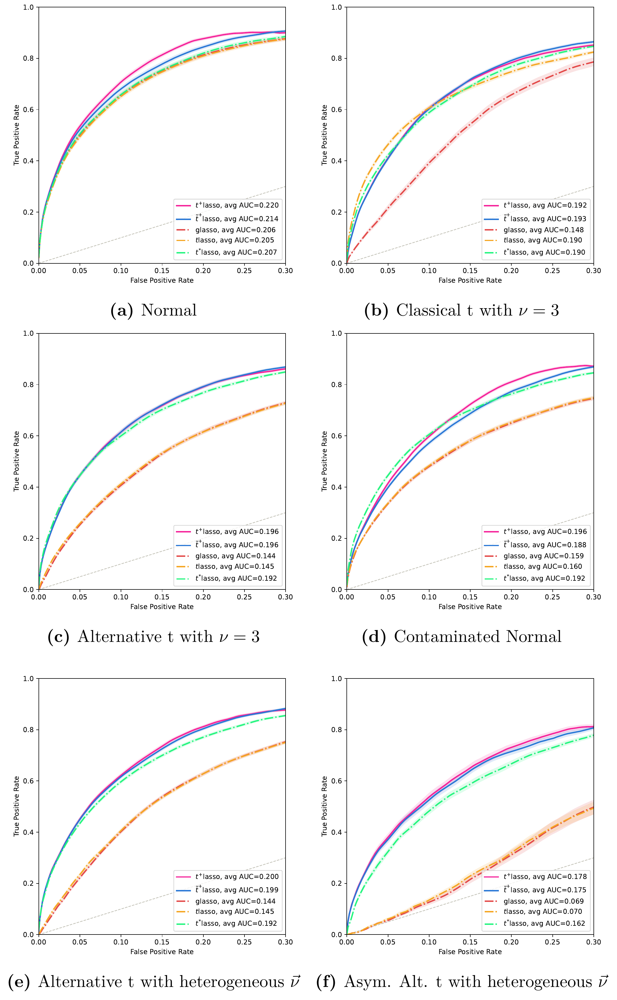
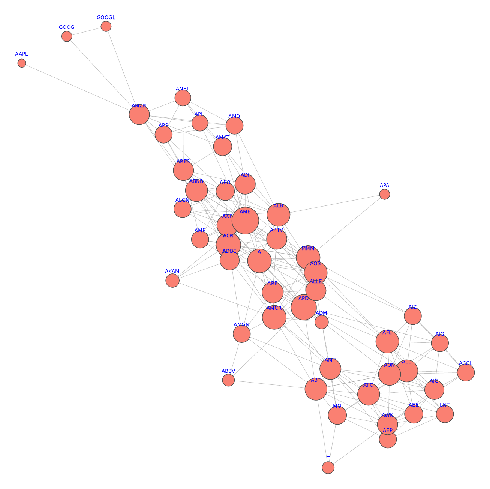

Gaussian graphical models are fragile under contamination. The Student-*t* fix ([Finegold & Drton, 2009](https://dl.acm.org/doi/10.5555/1795114.1795134)) helps, but a single contaminated entry downweights the entire observation. Their *alternative t* model gives each node its own divisor τⱼ, which is better — but it's still symmetric about μⱼ, and in practice the degrees of freedom νⱼ are shared across nodes.

Real data isn't like that. Gene expression and financial returns are both skewed, and some variables are far more outlier-prone than others. Thus, we introduce the **asymmetric alternative *t*-distribution**, which adds node-specific skewness and heterogeneous tail weight:

$$Y_j = \mu_j + \eta_j \nu_j \tau_j + \sqrt{\tau_j}\, X_j, \qquad \tau_j \sim \text{Inv-Gamma}(2/\nu_j,\, 2/\nu_j),\quad X \sim N_p(0, \Sigma)$$

Each node gets its own tail parameter νⱼ and asymmetry parameter ηⱼ. Multiplying the drift term by νⱼ is deliberate: it makes the model **identifiable at the Gaussian boundary**, since the skewness term vanishes as νⱼ → 0 rather than becoming indistinguishable from the mean.

Three estimators are implemented:

| Method | E-step | M-step |
|---|---|---|
| `t⁺_var-lasso` | Mean-field variational (GIG posterior) | Diagonal Θ |
| `t̃⁺_var-lasso` | Mean-field variational (GIG posterior) | Exact |
| `t⁺_MCMC-lasso` | Metropolis-within-Gibbs | Exact |

All three close with a graphical lasso step on Θ. The variational E-step exploits the fact that under a diagonal approximation the posterior factorizes into Generalized Inverse Gaussian densities, giving closed-form moments via Bessel functions — no sampling required.

## Results

Five methods compared across six data-generating regimes, 50 simulations each, p = 100, n = 50. The FPR axis is cut at 0.3 because ν-optimization becomes ill-conditioned beyond that for small ρ.

The takeaway: on Gaussian, classical *t*, and homogeneous alternative *t* data, our methods match the correctly-specified baselines — no penalty for the extra flexibility. On heterogeneous ν̄ and asymmetric data (panels e, f), they pull clearly ahead. The gap is starkest under asymmetry, where glasso and tlasso collapse to near-chance (AUC 0.069 and 0.070) while `t⁺-lasso` holds at 0.178.

## Applications

**S&P 500 log-returns** (2020–2026). Nodes are stocks, edges indicate conditional dependence after accounting for all other returns 

The clean equivalence `Θ_jk = 0 ⟺ conditional independence` **does not hold** for this model — it already fails for the Student-*t*. The quadratic form sits inside a power rather than an exponential, so zeroing the cross term doesn't factor the density.

We handle this two ways:

1. **Hypothesis testing.** Estimate conditional means via amortized variational inference, then apply the [Generalized Covariance Measure](https://arxiv.org/abs/1804.07203) to the residuals, with Benjamini–Hochberg controlling the false discovery rate across pairs.
2. **A sufficient condition.** We derive that Θ_ij = 0 *and* Θ_ip Θ_jq = 0 for all p, q ∉ {i,j} implies Yᵢ and Yⱼ are conditionally uncorrelated — equivalently, at least one of them is isolated in the graph.
